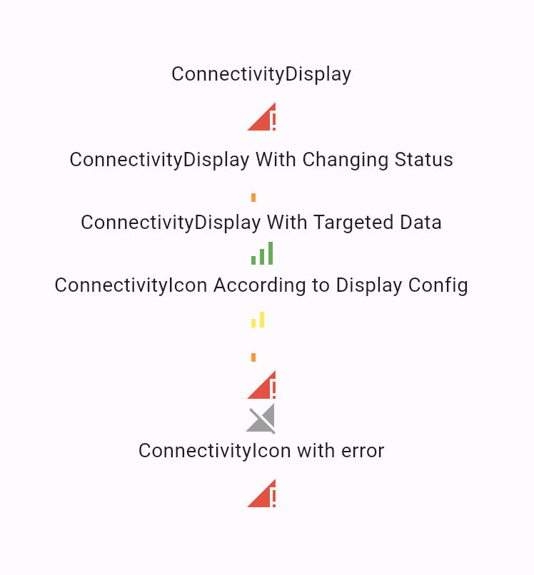
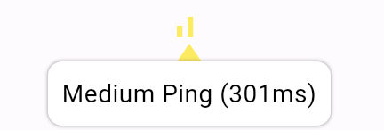

# Flutter Connectivity Checker

## Features
- A connectivity checker to return a stream of `ConnectivityStatus`, which include
  - able to connect to server (call the API), with different connectivity level (high / low ping)
  - not able to connect to the server but the network is available (e.g. server down)
  - network unavailable
- Also provided a `ConnectivityDisplay` widget to visualize the result

## Demo
> The demo code is available in the `example` folder

**ConnectivityDisplay widget display**
- The icon & color are configurable
- Wether to show the icon is configurable
  - e.g. you config it to show the icon only when the connectivity is problematic


**Icon with Tooltip**
- On tap, the tooltip will show the current connectivity status
- Message is configurable


**Exception at Snackbar**
- If setting is on, a snackbar will show the exception during the connectivity check when the icon is tapped


## Usage

**Config**
```dart
// config
var connectivityConfig = ConnectivityConfig(
    checkInterval: const Duration(seconds: 10), // check every 10 seconds
    pingLevelConfig: PingLevelConfig(
        goodPingThreshold: const Duration(milliseconds: 100), // ping <= goodPingThreshold -> goodConnection
        okPingThreshold: const Duration(milliseconds: 500)), // ping <= okPingThreshold -> okConnection
    pingUrl: 'http://localhost:3000/' // ping (HTTP GET) your server
); 
```

**Using the Stream Only**
```dart
Stream<ConnectivityStatus> connectivityStream = ConnectivityChecker.stream(config);
```

**Using the Widget**
```dart
// display config
var displayConfig = DisplayConfig(loadingIndicatorColor: Colors.black)
      ..set(
          ConnectivityStatusType.goodConnection,
          const DisplayConfigForStatusType.goodConnection(
                display: false, // don't display if goodConnection
            ))
      ..set(
          ConnectivityStatusType.okConnection,
          const DisplayConfigForStatusType.okConnection(
              showPingValue: true, // show the ping in the tooltip message
              iconColor: Colors.yellow))
      ..set(
          ConnectivityStatusType.poorConnection,
          const DisplayConfigForStatusType.poorConnection(
              iconColor: Colors.orange))
      ..set(
          ConnectivityStatusType.hasNetworkButNoConnection,
          const DisplayConfigForStatusType.hasNetworkButNoConnection(
              iconColor: Colors.red))
      ..set(ConnectivityStatusType.offline,
          const DisplayConfigForStatusType.offline(iconColor: Colors.grey));

// use the ConnectivityDisplay Widget directly
ConnectivityDisplay(config: connectivityConfig, displayConfig: displayConfig),
```

**Custom Request**
- A custom request operation can be provided to the `ConnectivityChecker` to check the connectivity status instead of ping (HTTP GET) the given URL. 
- The custom request should be a `Future<dynamic> Function()`
- It should throw an exception if the connectivity check fails / request timeout
- If no exception is thrown, the connectivity is classified by the time used to complete the request

Example:
```dart
var connectivityConfig = ConnectivityConfig(
    pingRequest: () async {
        // do some async operation here
        await Future.delayed(Duration(milliseconds: 100));
    }
);
```

**Request Factory**
- A request factory is provided to create the custom request operation

- The ping is considered successful if the request return with specified status code
```dart
request() async => ApiResponse(200, 'data');
var pingRequest = ConnectivityRequestFactory.requestWithTargetedResponseCode(
    request, [200]);
```

- The ping is considered successful if the request return specified data
```dart
request() async => ApiResponse(200, 'data');
var pingRequest = ConnectivityRequestFactory.requestWithTargetedData(
    request, (data) => data == 'data');
``` 